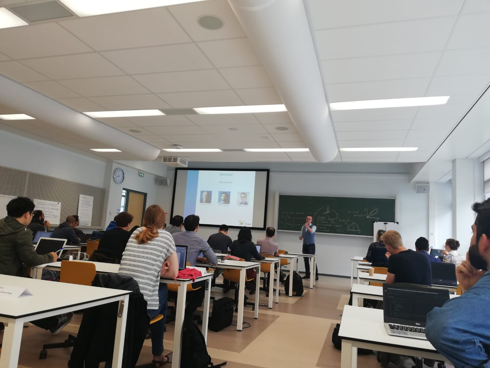

# Deep Learning Course TRAIL

This repository contains the slides and exercises from the two-day deep learning course given at TU Delft on June 5th and 6th.

## Lecture slides and exercises
The lecture and slides have kindly been provided by [Dr. Ir. Jan van Gemert](https://jvgemert.github.io/).

You can find the exercises and corresponding exercise notebooks in the corresponding folders. You can choose to do the exercises and run them on your local machine, or use them in Google Colab.

## A note on the used datasets
The used datasets are placed as a release on this repository. Extract them in the exercise folders.

Note that due to the terms of use, we **cannot** include the subset of the [CelebA dataset](http://mmlab.ie.cuhk.edu.hk/projects/CelebA.html) we used in the course. Please use your own dataset with these exercises of download the CelebA dataset yourself. Note you can only use it for non-commercial applications.

